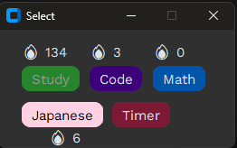
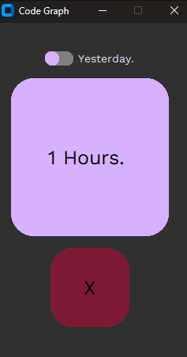
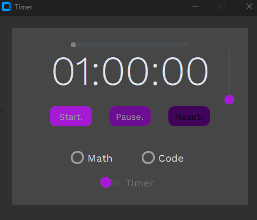

One of my first projects, built it around half a year ago and used it since. Using pixela api with a straightforward gui to track habits, helps to stay consistent(there are many better apps but I still use it cause I made it myself). Sadly many things are hardcoded so its not really usable for others, you can use it as a blueprint and create your own tho, thanks for cheking in.

GUI

